# Hermes Harness Integration — Comprehensive Plan

## 0. Scope and positioning

This plan adds an agentic runtime to Career Copilot while preserving the existing deterministic command system. The product positioning is fixed:

> **Career Copilot owns the domain**: Telegram integration, content catalogues, canonical user data, scheduled jobs, and the tool registry. **Hermes offers the conversational and agentic layer** that sits behind the existing surfaces.

The work is delivered in five phases over five weeks. Each phase is independently shippable and adds measurable value. Phases 1–3 are the core deliverable; phases 4 and 5 are optional follow-ups.

The existing backbone stays the source of truth:

- `backbone/tools/registry.py` — tool catalogue and ACLs
- `backbone/dispatcher/` — command routing and span emission
- `backbone/memory/` — three-tier memory (working, short-term, long-term)
- `backbone/model_client.py` — Gemini and DeepSeek
- `backbone/observability.py` — OpenTelemetry wiring
- `backbone/telegram/` — bot handlers and chat allowlist

The new layer is `backbone/hermes/` and a thin `career_copilot/hermes_bridge.py`. No existing file is rewritten unless a contract change is required.

## 1. Goals and non-goals

### Goals

- One Telegram bot, two execution modes per incoming message: deterministic command or conversational agent.
- Master’s planning becomes a first-class domain with goals, tasks, deadlines, decisions, and school applications.
- Free-form messages such as "I need a paper on these topics" can be processed end-to-end.
- Hermes memory is for agent context only; canonical data is PostgreSQL.
- All existing commands keep working with identical behaviour.
- Hermes tools, models, and costs are observable through OpenTelemetry.
- Tools are gated by a confirmation policy.

### Non-goals

- A second Telegram bot. Hermes does not connect to Telegram directly.
- Migrating canonical data into Hermes memory.
- Replacing Paper Tracker, Job Hunter, or Contribution Finder with Hermes.
- Replacing the existing scheduler in phase 1–3.
- Long-running voice without a clear use case. Phase 5 only.
- Public multi-user support. The chat allowlist remains.

## 2. Current architecture — what exists today

Codebase size: 11,894 lines of Python.

Key components:

- **Dispatcher** — `Dispatcher.handle_command(user_id, command, args)` returns a `TaskResult`. Only handles registered commands.
- **Telegram layer** — `command_digest`, `command_jobs`, and `_dispatch` translate Telegram commands to dispatcher calls. Chat allowlist by chat id.
- **ModelClient** — Gemini (primary) and DeepSeek, with OTel spans and token logging to `prompt_runs`. Pricing is hardcoded.
- **Tool registry** — `register`, `get`, `list_for_agent`, `schemas_for_llm`. ACLs are empty by default; new agents get open access.
- **Memory layer** — Working, short-term, long-term. Long-term uses Qdrant Cloud. Namespaces are declared in `backbone/memory/namespaces.py`.
- **Scheduler** — `ScheduleTool` plus a `scheduled_jobs` table. Two rows currently: `paper_tracker_digest` and `weekly_paper_tracker_engagement_report`.
- **Telegram voice** — not present.
- **Personality** — not present.

The plumbing for an agentic layer is mostly in place. The missing pieces are a ReAct loop, a tool-calling interface to Hermes, agent-scoped memory, and a conversational routing rule.

## 3. Proposed architecture

Hermes is the official Nous Research `hermes-agent` project, used programmatically through its `AIAgent` class. Domain tools reach Hermes through a Career Copilot MCP server. Hermes does **not** own Telegram.

```mermaid
flowchart TD
    TG[Telegram Bot] --> HND[Telegram handlers]
    HND --> ROUTE[Intent router]
    ROUTE -->|slash command| DET[Deterministic dispatcher]
    ROUTE -->|free-form message| BR[Hermes bridge]
    ROUTE -->|voice message| STT[Optional STT]
    STT --> BR

    DET --> EX[Existing handlers]
    EX --> REG[Career Copilot tool registry]
    EX --> MEM[Memory layer]

    BR --> AI[AIAgent from hermes-agent]
    AI --> MCPC[Hermes MCP client]
    MCPC --> MCP[Career Copilot MCP server]
    MCP --> REG

    REG --> PT[Paper Tracker tools]
    REG --> JH[Job Hunter tools]
    REG --> CF[Contribution Finder tools]
    REG --> PLAN[Planning tools]

    PT --> DB[(PostgreSQL)]
    PT --> QD[(Qdrant)]
    JH --> DB
    CF --> DB
    PLAN --> DB

    AI --> HMEM[Hermes memory and sessions]
    AI --> SKILL[Hermes skills]
    AI --> SCHED[Hermes cron]

    SCHED --> SCHTOOL[Scheduler adapter]
    SCHTOOL --> DB
```



### Integration boundary

- **Hermes native** — conversation loop, tool selection, context compression, session continuity, agent memory, personality, clarification, delegation, voice.
- **Career Copilot MCP** — domain tools and canonical data access.
- **Career Copilot direct** — Telegram, authentication, deterministic commands, schedules, PostgreSQL, Qdrant, observability, safety policy.

### Why MCP for domain tools

Hermes supports MCP servers as a first-class extension mechanism (stdio and HTTP). Exposing existing Career Copilot tools through an MCP server avoids rewriting them as native Hermes tools and keeps Hermes out of the application process.

Consequences:

- Hermes never receives database credentials.
- Career Copilot tools remain independently testable.
- Hermes upgrades do not break the tool registry.
- Hermes can be removed later without a rewrite.
- Tool surface is explicitly whitelisted per server.
- Hermes can run in a separate Azure container.

### Why not native Hermes tools

Native tools would require rewriting twenty-plus existing Pydantic tools against Hermes internals and would couple Career Copilot to a heavily-pinned dependency graph. The only things kept native to Hermes are memory, skills, personality, and session state, because those are Hermes-specific concerns.

### New directories

- `backbone/mcp/` — the Career Copilot MCP server and tool adapters
- `backbone/hermes/` — bridge and run orchestration around `AIAgent`
- `career_copilot/hermes_bridge.py` — routes a free-form message into the bridge

Specific modules:

- `backbone/mcp/server.py` — FastMCP server entry point
- `backbone/mcp/adapters.py` — wraps existing tools into MCP tools
- `backbone/mcp/policy.py` — ACL, confirmation, and output-size policy
- `backbone/hermes/bridge.py` — stable interface to `AIAgent`
- `backbone/hermes/runs.py` — run queue, checkpointing, cancellation
- `backbone/hermes/context.py` — context compiler and transcript compaction
- `backbone/hermes/planning/` — master’s planning workspace (phase 2)
- `career_copilot/hermes_bridge.py` — dispatcher adapter

## 4. Memory design

> **Verified correction (live): the only channel that reliably reaches Hermes
> is its native memory (`~/.hermes/memories/USER.md`), not the system prompt.**
> The Hermes API server composes its own ~11k-token system prompt from
> config/SOUL.md/memory and **ignores a `system` message sent inside a
> chat-completions request** (proven empirically with a probe prompt).
>
> So the user profile is **seeded once into `USER.md` from the project YAML**, and
> `career.profile.get` remains the canonical, up-to-date source for deep
> lookups. See §26 for full verified facts.

### Three levels, kept intact

| Level | Owner | Storage | Lifetime | Examples |
|---|---|---|---|---|
| Working | Hermes runtime | In-memory dict | Single conversation | "the third paper", active filters |
| Short-term | Memory layer | PostgreSQL | 7 days default | Today’s research thread, last request |
| Long-term | Memory layer | PostgreSQL + Qdrant | Reviewed | User preferences, recurring patterns |

The **Hermes memory layer** for the current single-user build is deliberately light:

- `~/.hermes/memories/USER.md` — the user model, **seeded from the project YAML** (research interests, keywords, skill clusters, facts). This is what the API server actually loads.
- Conversation history (per-chat, bounded) — tracked by the Hermes bridge, because the API server is stateless.
- `agent_short_term` / `agent_memories` / `conversation_sessions` tables — **optional / future**. Not needed until multi-user or cross-session recall matters.

Important: agent memory is **retrievable context only**. It is never the source of truth. Career Copilot memory namespaces, PostgreSQL tables, and the project YAML remain authoritative.

### What Hermes can write

- Conversation-level notes ("the user prefers temporal abstractions")
- Inferred patterns ("the user often selects implementable IR papers")
- Draft decisions ("maybe use the no-GRE route at McGill")

### What requires explicit tools

- Profile updates. Use `profile.propose_update`, not direct memory writes.
- Goal and task CRUD. Use planning tools.
- Schedule changes. Use the scheduler adapter.
- Anything touching `professors`, `jobs`, `companies`, `saved_jobs`, `feedback_log`.

### Confidence and provenance

Every `agent_memory` row carries:

- `source` — tool name or conversation reference
- `confidence` — 0.0–1.0
- `created_at` and `last_confirmed_at`
- `expires_at` — optional
- `scope` — `chat`, `user`, `workspace`

Memory proposals that drop below 0.5 confidence or exceed their expiry are summarized for the user, never silently overwritten.

## 5. Planning workspace — phase 2

A new planning domain is the highest-leverage feature. Schema:

- `planning_workspaces` — id, name, intake year, target degree, owner, status
- `planning_goals` — workspace_id, title, description, parent_id, priority, status
- `planning_tasks` — goal_id, title, description, due_date, assignee, status, blocked_by
- `planning_decisions` — workspace_id, title, rationale, status, decided_at
- `school_applications` — workspace_id, school, program, deadline, status, notes
- `application_requirements` — application_id, kind, status, notes
- `planning_notes` — workspace_id, kind, body, pinned, created_at

Natural-language interactions:

> "I want to start planning my Master's application for 2027."

This creates a workspace with draft goals and suggested tasks.

> "Compare Waterloo and Alberta for my profile."

This returns a structured comparison using profile data, school tiers, and deadlines.

> "I may not be able to afford the GRE this year. Update the plan."

This proposes several decisions and waits for confirmation.

> "What am I behind on?"

This returns tasks past due or blocked.

> "Show the evidence for classifying Waterloo as a reach school."

This surfaces the rationale and links to the source memory.

Confirmation policy:

- Creating a workspace — confirm
- Adding a school — confirm
- Recording a decision — confirm
- Updating task status — auto
- Adding a note — auto
- Deleting anything — double confirmation

## 6. Tool registry changes

### Existing schema

```python
class Tool:
    name: str
    description: str
    input_schema: type[BaseModel]
    output_schema: type[BaseModel]
    cost_hint: CostHint
    latency_hint: LatencyHint
    owner: str
```

### What the MCP adapter needs

The existing tools are not rewritten. The MCP server wraps them and adds policy fields at the adapter layer:

```python
class MCPToolAdapter:
    tool: Tool
    requires_confirmation: bool = False
    risk_level: Literal["low", "medium", "high"] = "low"
    side_effect: bool = False
    confirmation_prompt: str | None = None
    output_token_cap: int = 2000
```

If the core `Tool` model is extended later, the flags above can move into it. For the first MCP version they stay in the adapter so the existing registry is unchanged.

### Per-agent ACLs

Move from open-by-default to explicit allowlist. The MCP server refuses to expose a tool that Hermes is not allowed to use, and the Hermes config whitelists tools per server via `tools.include`.

### Tool groups exposed to Hermes via MCP

- **Read-only research** — `career.papers.search`, `career.papers.get`, `career.professors.search`, `career.professors.get`, `career.jobs.search`, `career.contributions.search`, `career.interests.get`, `career.memory.search`
- **Conversational** — `career.profile.get`, `career.workspace.get`
- **Write (confirm)** — `career.planning.*`, `career.profile.propose_update`, `career.scheduler.add`
- **Strong confirm** — `career.data.delete` (deferred beyond phase 1)

Hermes native memory, skills, personality, session search, and clarification tools are used directly and are not routed through Career Copilot MCP.

## 7. Routing rules

The dispatcher decides between deterministic and agentic mode for each incoming message.

### Deterministic if

- Starts with `/`
- Matches a registered command and the agent supports it
- The user explicitly typed `/help` recently

### Agentic if

- Plain text without a leading slash
- Voice message (after STT)
- Plain text that loosely matches an agent command but contains multi-token intent

### Conflict resolution

- If a `/command` is unknown, return the existing help text, not an agent fallback
- If the user prefixes a message with `/ask`, force the agent path
- If the user prefixes with `/cmd`, force the deterministic path

### Initial state

Only enable the agentic path for your Telegram chat id. The chat allowlist remains the safety boundary.

## 8. Run-time model

Hermes `AIAgent` already owns the agent loop, tool dispatch, retries, compression, and cancellation. Career Copilot wraps it rather than re-implementing a ReAct loop.

### Loop ownership

- `AIAgent.run_conversation()` drives the model/tool loop internally.
- Career Copilot supplies the MCP tools, run budget, and cancellation signal.
- Progress events are surfaced from tool activity, not from hidden reasoning.

Run limits enforced by the bridge:

| Limit | Default |
|---|---|
| Max steps | 8 |
| Budget cap | 50 cents |
| Wall clock | 90 seconds |
| Max LLM calls | 20 |
| Max tool calls | 30 |

### Errors and retries

- Model 429 — Hermes retries; if exhausted, surface to user.
- Tool raises — record in audit, return the error to Hermes, let it reformulate.
- Timeout — abort and return a partial answer.
- Cancelled by user — return current state.

### Cancellation

A `run_id` is generated per free-form message. `/cancel <run_id>` stops the run. The id is included in the first response.

### Parallelism

Phase 1 is single-turn. Phase 4 enables bounded parallel tool calls via `AIAgent` delegation.

## 9. Confirmation policy

Every write tool declares a risk level. The runtime enforces it:

| Risk | Behaviour |
|---|---|
| low | Execute and report |
| medium | Preview, ask to confirm |
| high | Require explicit `confirm` reply; auto-expire after 30 minutes |

The policy is also configurable per workspace. A "research only" workspace permits low risk only. A "master's planning" workspace permits medium risk without confirmation because the user is iterating.

## 10. Hooks

Five hooks fire at every step:

- `before_turn` — load persona, working memory, recent messages
- `before_tool_call` — ACL check, confirmation gate, rate limit, OTel span
- `after_tool_call` — audit log, redaction, memory update
- `after_turn` — OTel span, latency, cost, save of final answer
- `on_error` — record, classify, retry or abort

All hooks emit OpenTelemetry spans. The audit log is searchable in PostgreSQL.

## 11. Scheduling

Phase 1 keeps the existing scheduler untouched. The Hermes adapter exposes:

- `schedule.create(name, cron, payload, ttl)`
- `schedule.list(scope)`
- `schedule.delete(name)`

It translates to `ScheduleTool` and enforces:

- One owner per job name
- Default 30-day expiry unless renewed
- Confirmation required for `delete`

Phase 3 wires Hermes cron to use the adapter. The existing scheduled jobs (`paper_tracker_digest`, `weekly_paper_tracker_engagement_report`) remain routed through the deterministic handler.

## 12. Voice

Phase 5 only. Inputs:

- Telegram voice messages are downloaded and transcribed with Whisper or similar
- The transcript is routed like any free-form message

Outputs:

- Text by default
- Optional TTS only when the user opts in via `/voice on`

Cost and quality concerns make voice optional. Skipping it is fine.

## 13. Personality

Persona configuration:

```yaml
personas:
  default: research mentor
  professional: structured, concise, no slang
  concise: minimal wording, no preamble
  research_mentor: encouraging, suggests next steps
  planning_coach: focused on deadlines and decisions
  friendly: warm, conversational
  pirate: novelty, only affects presentation
```

Rules:

- Persona influences wording only — never ranking, never canonical data
- Persona is session-scoped by default; persistent personas are opt-in
- Career Copilot saves the active persona in the conversation session record
- Persona lives in Hermes's `SOUL.md` (loaded into its self-built prompt). Persona switching swaps/switches the `SOUL.md` content and reloads the gateway — the API server ignores a `system` message, so it cannot carry a persona (see §26-A)

## 14. Cost and rate limits

Per-run:

- Token budget: 100k input, 4k output
- Cost budget: 50 cents per run, configurable up to 200 cents
- Wall clock: 90 seconds default, configurable up to 5 minutes
- LLM calls: 20 per run
- Tool calls: 30 per run

Per-day:

- 50 free-form messages per user
- Free-form messages cost tokens; digests and commands are free

Per-tool:

- Tavily and Firecrawl paginate at 1000 and 500 respectively per month
- LlamaParse costs are tracked per call
- Voyage at 96 documents per batch

These are enforced in `hooks.py` and surfaced back to the user as warnings.

## 15. Observability

Every Hermes run creates:

- A `hermes_runs` row with `run_id`, `user_id`, `chat_id`, `started_at`, `ended_at`, `model`, `tokens`, `cost_usd`, `status`, `final_answer`
- Child `hermes_tool_calls` rows with `tool_name`, `args`, `output_excerpt`, `latency_ms`, `outcome`
- An OpenTelemetry trace with `agent = "hermes"`, `command = "free_form"`, `tool.name`, `gen_ai.*` attributes
- A `prompt_runs` row when a model is called

The trace is exported to Azure Application Insights via the existing OTLP exporter. A Grafana dashboard (or App Insights workbook) tracks:

- Runs per day
- Average turns per run
- Most-used tools
- P95 latency per tool
- Cost per day
- Failure modes by hook
- Persona distribution

A natural-language evaluation harness (Hermes-as-judge) becomes available in phase 4.

## 16. Security

- Tools declare `risk_level`. The runtime refuses to call a tool that does not match the agent's mode.
- All egress is logged. Pydantic models for tool arguments prevent injection.
- Hermes cannot modify `professors`, `jobs`, `companies`, `saved_jobs`, `feedback_log`, `prompt_runs`, `hermes_runs`, `agent_memories` directly. It must go through the dedicated tools.
- The chat allowlist is enforced in the dispatcher before the bridge.
- Hooks redact `secrets`, tokens, and emails before logging.
- Cron jobs are owned by schedule name. Deleting requires explicit confirmation.
- Voice transcripts are not stored beyond session lifetime.

## 17. Test plan

### Unit tests

- `runtime.py` — max steps, budget cap, cancellation, errors
- `routing.py` — slash vs plain text decision
- `memory.py` — confidence decay, expiry, scope
- `hooks.py` — ACL, rate limit, redaction
- `persona.py` — switching, persistence
- `scheduler_adapter.py` — ownership, expiry

### Integration tests

- Free-form paper request end-to-end
- Planning workspace creation, decision, task update
- Schedule creation and run
- Confirmation flow for a write tool
- Cancellation by run id
- Invalid tool call rejected by hook

### Evaluation

A weekly hermes-eval job records:

- 10 paper requests
- 5 planning interactions
- 3 scheduling interactions
- 1 voice turn

Each is graded by a separate evaluator prompt on:

- Correct tool selection
- Evidence quality
- Persona consistency
- Memory accuracy
- Cost per resolution

The report is appended to `benchmarks/hermes_eval_<date>.md`.

## 18. Phased delivery

### Phase 1 — agentic conversational layer (week 1)

- `backbone/hermes/` runtime scaffolding
- Routing in `career_copilot/hermes_bridge.py`
- Read-only tools exposed
- Confirmation policy for writes
- OpenTelemetry spans
- `/reset` and `/cancel`
- Persona default only
- Chat allowlist unchanged
- 10 unit tests
- 3 integration tests

### Phase 2 — master’s planning workspace (week 2)

- Planning schema migration
- Planning tools
- "I want to start planning" entry point
- Conversational create/update
- Weekly review
- Confirmation gates
- 6 integration tests
- Seed: 2027 Canada workspace

### Phase 3 — scheduling and automation (week 3)

- Scheduler adapter
- Cron support
- Deadline monitoring
- Weekly progress summaries
- 5 integration tests
- 3 end-to-end scripts

### Phase 4 — delegation and parallel tool use (week 4)

- Subagents: research scout, admissions scout, OSS scout, evidence verifier
- Bounded parallel tool calls
- Hermes-as-judge evaluator
- 5 integration tests
- Benchmark report

### Phase 5 — voice and personality (week 5)

- Voice transcription
- Optional TTS
- Persona switching
- `/persona` and `/voice`
- 4 integration tests

## 19. Acceptance criteria

### Phase 1 (must pass)

- Free-form message: "I need a paper on evaluation infrastructure for RAG agents" returns 3–5 ranked papers with why explanations.
- Cancellation works within 2 seconds.
- Chat allowlist still blocks unknown chat ids.
- OTel spans appear in App Insights.
- Persona switches for the session.
- Tool ACL blocks an unauthorised tool.

### Phase 2 (must pass)

- "I want to start planning my Master's" creates a workspace with 5 draft goals.
- "Compare Waterloo and Alberta" returns a structured comparison with profile references.
- Decision records show rationale and date.
- Confirmation gates appear for write operations.
- Workspace state is queryable from the CLI.

### Phase 3 (must pass)

- Cron jobs can be scheduled and cancelled.
- Scheduled jobs survive restarts.
- Owner of a job cannot be changed without explicit confirmation.
- Daily progress summary fires at 09:00.

### Phase 4 (must pass)

- Research scout agent returns results in parallel.
- Admissions scout returns plausible recommendations.
- Evidence verifier flags unsupported claims.
- Benchmark report renders.

### Phase 5 (must pass)

- Voice message is transcribed and routed.
- TTS is opt-in.
- Persona commands persist across sessions.

## 20. Risks and mitigations

| Risk | Mitigation |
|---|---|
| Hermes Agent API changes | Adapter layer isolates the dependency |
| Hallucinated URLs in outputs | Evidence verifier agent in phase 4 |
| Cost runaway from free-form use | Per-run budgets enforced by hooks |
| Tool sprawl makes the system prompt confusing | Tool groups; per-agent ACLs; allowlist-only |
| Memory pollution | Confidence decay, expiry, explicit `forget` |
| Cron job duplicates from existing scheduler | Adapter refuses to register a duplicate |
| Race conditions in memory writes | Namespaced transactional writes |
| Voice costs | Text by default; voice opt-in |

## 21. Open questions to resolve before phase 2

- Which Hermes version and tool schema will we pin? — **resolved: `NousResearch/hermes-agent`, `0.20.2` at probe, imported as `AIAgent`**
- Does the chosen Hermes library support Postgres/Qdrant backends, or do we need a custom adapter? — Hermes uses its own `~/.hermes/` memory files; Career Copilot keeps Postgres/Qdrant authoritative and exposes them via MCP.
- Do we want a separate model for evaluation (a different Hermes model)?
- Should the planning workspace be a single "Master's 2027" workspace or multiple per school?
- Do we want to keep the existing `paper_tracker_digest` schedule, or move it to Hermes cron too?
- Is `/reset` enough, or do we need `/forget` per-namespace?
- Should voice be added now or deferred past phase 5?

## 22. Quick wins for the first day

**Status: all shipped (Phase 1 complete).** The original first-day steps and their outcomes:

1. Install Hermes Agent via the official installer; verified `from run_agent import AIAgent`. — done
2. Confirmed `agent.chat()` / `run_conversation()` with `quiet_mode=True` and dangerous toolsets disabled. — done
3. `backbone/mcp/` with read-only tools (`career.profile.get`, `career.papers.search`, `career.professors.search`, `career.jobs.search`). — done
4. Wired Hermes → MCP via `~/.hermes/config.yaml` `tools.include` allowlist. — done
5. Confirmed Hermes can call the tools and return results. — done (verified live)
6. Chat-allowlist enforced on every Hermes entry point. — done

Additional shipped: auto-routing (plain text → Hermes), `/ask`, `/cancel`, `/new`, professor discovery
(CSRankings), Postgres FTS search, OTel span on bridge calls, inline async briefs (RabbitMQ bypassed),
and `USER.md` memory seeding (see §26).

## 23. Summary

The right target is:

> **Career Copilot stays the product and the source of truth. Hermes becomes the conversational and agentic runtime behind it.**

The free-form experience unlocks real value in master’s planning, paper research, and conversational multi-turn tasks. The deterministic command system remains as reliable primitives. Tool gating, memory separation, and OTel keep the system safe and observable.

Time required: 5 weeks for one developer, in phased delivery.

---

## 24. Selected additions from the review

The architectural review surfaced more than thirty ideas. The following are the ones that are worth doing for a single-user platform. Each addition is small, justified, and grounded in something Career Copilot already needs.

### 24.1 Pin Hermes Agent before design freeze

Resolved. The harness is the official Nous Research `hermes-agent` project. Verified facts:

| Fact | Value |
|---|---|
| Repository | `NousResearch/hermes-agent` |
| License | MIT |
| Version at probe | `0.20.2` |
| PyPI install | Unsupported |
| Programmatic entry | `from run_agent import AIAgent` |
| Simple call | `agent.chat(message)` returns a string |
| Full call | `agent.run_conversation(user_message=..., task_id=...)` returns a dict with `final_response` and `messages` |
| Embedding flag | `quiet_mode=True` is required |
| Tool control | `enabled_toolsets` / `disabled_toolsets` |
| Extension point | MCP servers, stdio and HTTP |
| Config dir | `~/.hermes/` (`config.yaml`, `.env`, `SOUL.md`, `memories/`, `skills/`, `cron/`, `sessions/`) |
| Docker image | `nousresearch/hermes-agent` |
| API server | OpenAI-compatible HTTP on port `8642` (stateless) |

Supported installation paths:

```bash
# Official installer
curl -fsSL https://hermes-agent.nousresearch.com/install.sh | bash

# Or git clone + uv sync
cd ~ && git clone https://github.com/NousResearch/hermes-agent.git
cd hermes-agent && uv sync
```

Unsupported installation paths that must be avoided:

```bash
pip install hermes        # unrelated PyPI package
pip install hermes-agent  # unsupported by Nous
uv add hermes             # unrelated PyPI package
```

The programmatic contract is `AIAgent`, so the runtime section needs only a thin adapter. Before coding, confirm: provider support for the current Gemini/DeepSeek keys, a clean `chat()` round-trip, two-turn history retention, cancellation, and headless operation inside a container.

### 24.2 Long-running jobs use a queue, not the Telegram handler

The current dispatcher is synchronous. A Hermes request that takes minutes would block the Telegram polling loop, violate Telegram's 30 second answer window, and be lost when Azure rolls a revision.

Minimum viable queue:

- A `hermes_runs` table with `status`, `progress`, `final_answer`, `cancel_requested`
- A background worker that picks up queued runs
- Progress messages sent back to the same chat
- A `run_id` returned in the first reply so the user can `/cancel`

The runner can stay simple (`for run in pending: await process(run)`). Redis is not required.

### 24.3 Context compiler

A master’s planning conversation will eventually exceed model context. The runtime must compose a fixed shape each turn:

1. Latest user message
2. Active workspace summary
3. Relevant profile fields
4. A handful of relevant semantic memories
5. The current artifact state
6. Compacted transcript of older turns
7. Outstanding pending actions

Keep total tokens under 8k. Compact the transcript when it exceeds 3k. Keep the most recent two full turns verbatim.

### 24.4 Prompt-injection guardrails

The agent will scrape careers pages, GitHub issues, and arXiv abstracts. Any of them can contain instructions aimed at the model. Add three small guards:

- A `untrusted_content` tag on every tool result
- A persistent hard rule in Hermes's `SOUL.md` that tool results are data, not instructions (a one-off `system` message is a no-op — see §26-A)
- Strip obvious instruction-like patterns from scraped pages in the MCP policy layer before sending

This is enough for a single-user system. Extensive guardrails are not needed.

### 24.5 Tool results are preprocessed

Firecrawl pages and paper abstracts can be too large. Before they reach the model:

- Strip navigation, footers, and repeated chrome
- Extract only the passages relevant to the request
- Attach a citation metadata block
- Cap each tool result at 2 000 tokens

The raw result is preserved in the audit log so the user can open it later.

### 24.6 Evidence provenance contract

Every research statement should carry provenance:

- Source URL
- Retrieval date
- Quoted snippet
- Tool used
- Confidence

Apply this from the first phase. Provenance cannot be retrofitted later without re-running every past result.

### 24.7 Freshness windows

Default re-verification windows:

| Data | Window |
|---|---:|
| Application deadline | 7 days |
| Admission requirement | 30 days |
| Job posting | 72 hours |
| Professor affiliation | 90 days |
| Rating tier | 180 days |

The agent should flag any claim sourced from memory older than the window. The deterministic re-check tool covers the rest.

### 24.8 Artifact-based workspaces

Conversations produce durable artifacts, not just chat history:

- `reading_plan`
- `school_comparison`
- `research_direction_brief`
- `professor_shortlist`
- `application_plan`
- `decision_memo`

Each artifact has a type, version, source run, evidence, and status. New requests work on the active artifact of the workspace. Plain text becomes a way to create and edit real objects.

Without this, the bot is a chatbot with extras. With it, the bot becomes a personal career operating system.

### 24.9 Decision lifecycle

A plan needs to distinguish:

- Idea
- Assumption
- Recommendation
- Proposed decision
- Confirmed decision
- Superseded decision

Every decision stores evidence, the profile version, and the date. "Waterloo is a reach school" is recorded as a recommendation with cited sources, not as a fact.

### 24.10 User-visible memory controls

`/reset` is not enough. Add:

- `/memory show`
- `/memory search <query>`
- `/memory forget <id>`
- `/memory correct <id>`
- `/memory export`

Also notify the user when durable memory is created:

> I can remember "prefers research-oriented MSc programs." Save this?

With a one-tap confirmation. Without this, the agent will accumulate memories the user cannot see.

### 24.11 Undo and audit

Confirmed writes should be reversible. Add:

- `/undo` for the last change
- `/history` for the recent audit log
- `/run <id>` for inspecting a past agent run

Each planning write is versioned. A deleted task can be restored. A profile update can be reverted.

### 24.12 Intent routing with confidence

Plain text can be:

- A continuation of the active workflow
- A short answer to a pending confirmation
- A new request
- A typo of a command

The router must check:

- Active run
- Pending confirmation
- Reply-to-message context
- String similarity to registered commands

When unclear, ask one clarifying question rather than guessing.

### 24.13 Model routing strategy

Three model roles are enough for a single user:

| Role | Choice |
|---|---|
| Agent planning and tool use | Strong tool-use model |
| Structured extraction (JSON) | Gemini Flash |
| Cheap summarization | Lowest-cost model |

Different models for different tasks. The same model does not produce and judge an answer.

### 24.14 Visible progress, hidden reasoning

Telegram progress messages should be action-oriented:

```
Researching your request...
✓ Loaded your research profile
✓ Found 28 candidate papers
• Verifying the top 8
• Building a reading sequence
```

Never expose the model's hidden chain-of-thought. Show actions, status, evidence, and results.

### 24.15 Notification inbox

Paper Tracker, Job Hunter, Contribution Finder, and Hermes reminders should not all message independently. Add a single inbox:

- Priority
- Category
- Deduplication key
- Expiry
- Quiet hours
- Bundling group

Bundled into one Telegram message per quiet-hours window. A single `/digest` style command for the inbox.

### 24.16 Proactive assistant boundaries

Hermes should not be overly chatty. Defaults:

- Maximum two proactive messages per day
- Quiet hours aligned with `Africa/Lagos`
- New recurring schedules require confirmation
- Deadline alerts only if the active workspace opted in
- Weekly summary bundles non-urgent items

A proactive bot without these limits becomes noise.

### 24.17 Schema versioning and migrations

New tables and columns require strict migration discipline:

- Add before reading
- Two revisions behind support
- Avoid destructive renames
- Backfill before flipping a flag
- Lock the migration during cleanup

The harness runner refuses to start if its database version is too old.

### 24.18 Data retention and privacy

A single user still needs clear retention:

- Voice transcripts are removed after the run
- `prompt_runs.output` is truncated to 600 chars or redacted
- `/export` produces a JSON dump of profile, memories, and artifacts
- `/wipe` deletes everything except the audit log

Privacy is a feature, not a future concern.

### 24.19 Shadow mode before live writes

For the first week, Hermes runs in shadow mode:

- Read-only tools are unrestricted
- Write tools are allowed but not executed
- The user sees the proposed action and the expected result
- A confidence score is shown

Switch from shadow to live after a week of useful proposals.

### 24.20 Baseline evaluation

Before claiming "Hermes is better," define the baselines:

| Baseline | Description |
|---|---|
| B0 | Deterministic commands only |
| B1 | Single-prompt Gemini, no agent loop |
| B2 | Hermes with no memory |
| B3 | Hermes with memory |

Measure task completion, tool accuracy, unsupported claims, latency, cost, and user satisfaction. Without baselines, the harness is a demo, not a feature.

### 24.21 Degraded operation

Backups for every external dependency:

| Dependency | Fallback |
|---|---|
| Hermes runtime down | "Processing later" + queue |
| Qdrant down | Skip search, surface arXiv results |
| PostgreSQL down | Reply that the system is offline |
| Gemini 429 | Switch to DeepSeek, then local model |
| Tavily quota | Use cached results |
| Voice down | Text only |

The recent Qdrant outage shows that graceful degradation is part of the product.

### 24.22 Test environment

Hermes is non-deterministic. Test with:

- Recorded tool fixtures
- A fake model adapter
- Golden planning scenarios
- An injection corpus
- Replayable runs

Without fixtures, every regression requires a real LLM call.

### 24.23 Correction to a §23 estimate

The five-week estimate assumes the existing codebase is ready. After the additions in this section, budget an extra week:

- 1 week for the compatibility spike, queue, and shadow mode
- The original five weeks for the phased delivery

Realistic timeline: six weeks.

---

## 25. Summary (revised)

The right target is:

> **Career Copilot stays the product and the source of truth. Hermes becomes the conversational and agentic runtime behind it.**

The earlier version of this plan focused mostly on runtime wiring. The 23 additions above turn it into a complete product concept:

- A queue for long-running work
- A context compiler for multi-turn planning
- An evidence and freshness contract for every recommendation
- An artifact model that turns conversations into real outputs
- A decision lifecycle that scales over years, not days
- User-visible memory controls and undo
- Visible progress, hidden reasoning
- A notification inbox, proactive limits, and quiet hours
- Schema versioning, retention, and privacy
- Shadow mode before writes go live
- Five deterministic baselines for honest evaluation
- Degraded operation for every external dependency
- A test environment that survives CI

---

## 26. Verified integration facts and corrections

Findings from live testing that shaped the implementation. These correct
earlier assumptions in this document.

### A. The Hermes API server ignores a `system` message

**Verified:** a chat-completions request with `{"role":"system", "content":"Reply with exactly: SYSTEM-PROMPT-OK"}`
was answered with "Hello! How can I help you today?". Hermes builds its own
~11k-token system prompt from config/SOUL.md/memory and overrides any `system`
message we send.

**Consequence:** system-prompt injection from the bridge is a **no-op**. The only
channel that reliably reaches Hermes's self-built prompt is its **native memory**
(`~/.hermes/memories/USER.md`). The profile is seeded there once from the project
YAML; deep lookups use `career.profile.get`.

### B. RabbitMQ/Celery is fragile for a single-user brief queue

**Verified:** `/prof` enqueued briefs to Celery, but the configured `RABBITMQ_URL`
had an unresolvable host, so tasks sat in Celery's retry buffer and were never
processed. `python -m career_copilot worker` is the scheduled-jobs poller, not a
Celery worker — a silent mismatch.

**Consequence:** briefs run **inline** in the bot as an `asyncio` task
(`generate_brief_and_send_async`). The Celery task still wraps it for future
cloud/Modal use, but single-user local setups need no broker.

### C. Phase 1 shipped status

- One Telegram bot; Hermes is an internal runtime (no Hermes messaging).
- Auto-routing: plain text → Hermes; `/ask`, `/cancel`, `/new`.
- MCP server: `career.profile.get`, `career.papers.search` (arXiv, relevance-ranked),
  `career.professors.search` (watchlist via Postgres FTS + CSRankings discovery),
  `career.jobs.search` (Postgres FTS + region).
- Memory: `USER.md` seeded from YAML; bridge keeps bounded per-chat history.
- Briefs: inline async (no broker).
- Tests: 20+ passing (adapters, bridge, agent).

### D. Remaining work

- **Phase 2** — planning workspace + artifacts (§5, §24.8), decision lifecycle (§9, §24.9),
  write-tool gating (§9), evidence provenance everywhere (§24.6).
- **Phase 3** — scheduling adapter, notification inbox (§24.15), proactive limits (§24.16).
- **Phase 4** — delegation, parallel calls, baseline evaluation (§24.20).
- **Phase 5** — voice, personality (§12, §13).
- Cross-cutting — user-visible memory controls (§24.10), undo/history (§24.11),
  freshness windows (§24.7), `prompt_runs.output` truncation (§24.18).

The additions are intentionally small. Each is justified by something the platform already needs. The harness is no longer wiring. It is the operating system for your career.
